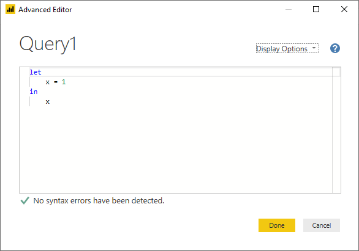

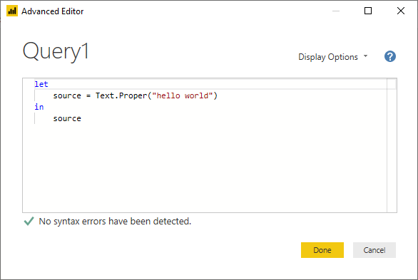

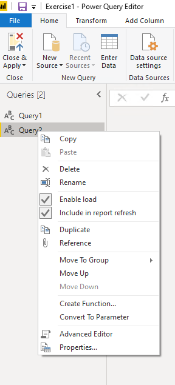

Rename to Products.

Enter the following.

let

Source = Sql.Database("sqlazuredw001.database.windows.net", "AdventureWorksDW",
[Query="EXEC GetProducts "])

in

Source

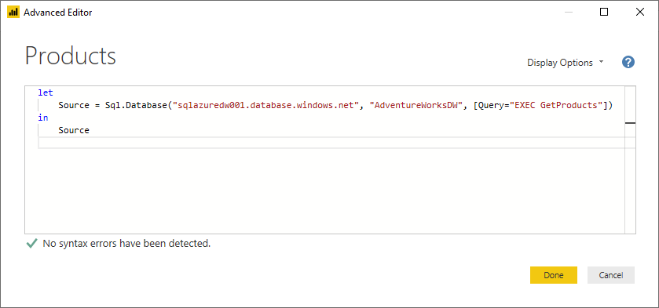

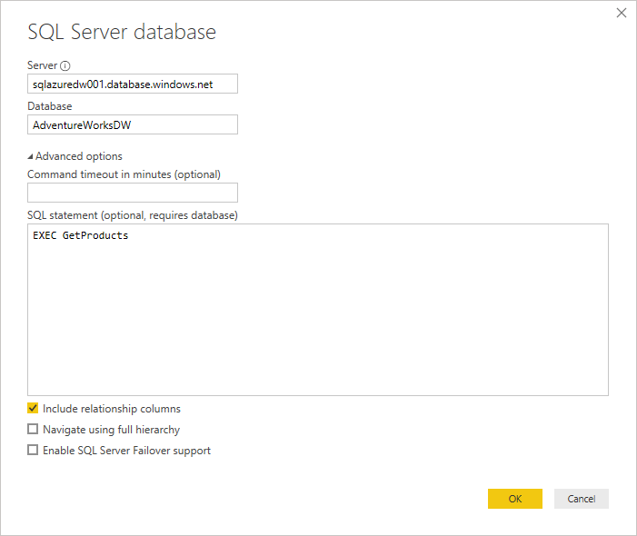

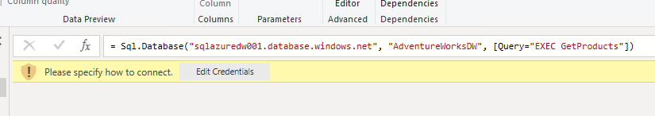

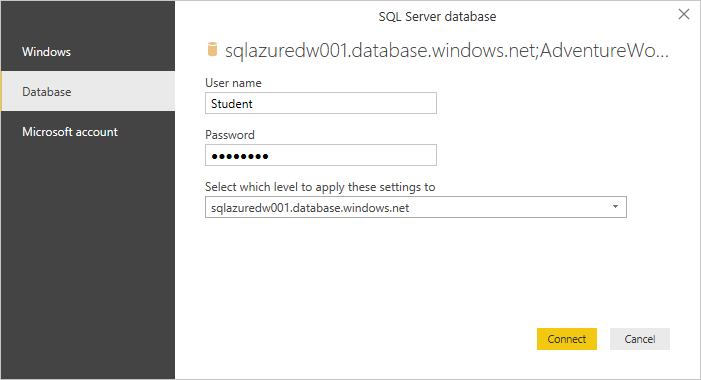

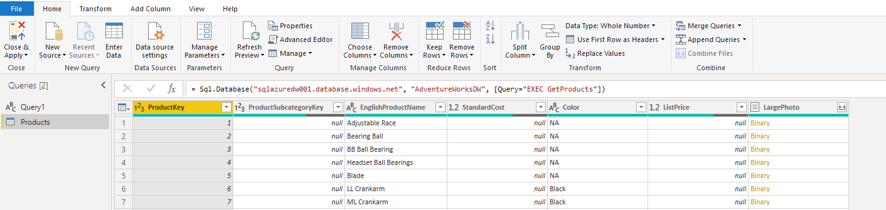

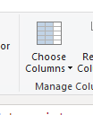

\----------------\>\> REDO WITH CATEGORIES

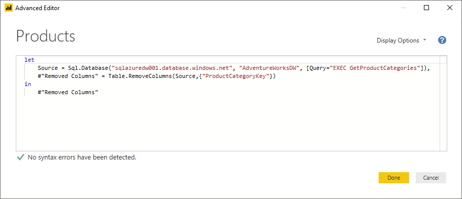

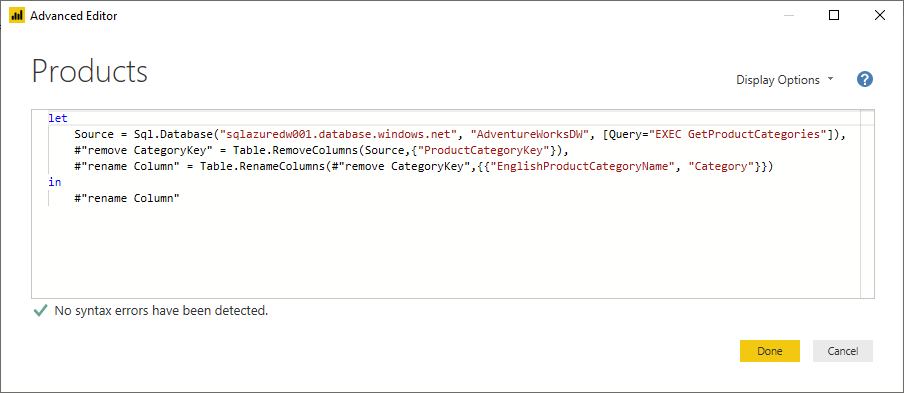

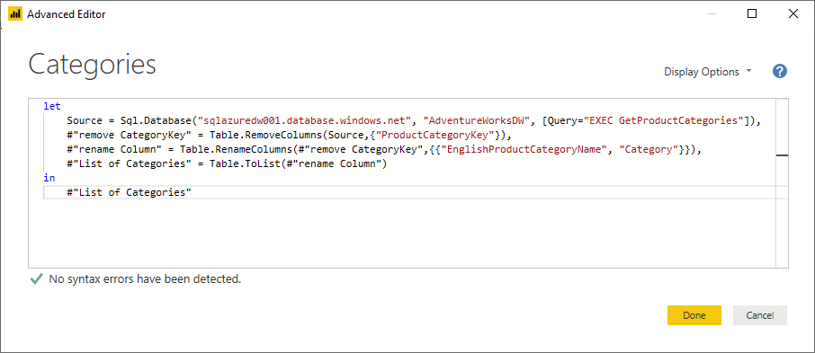

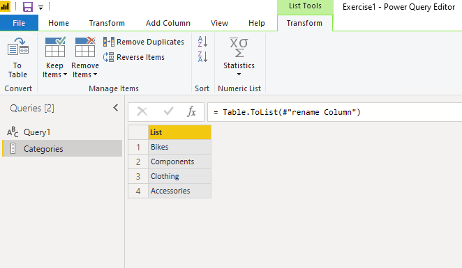

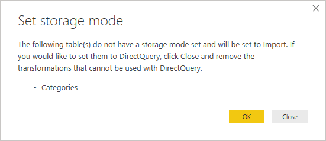

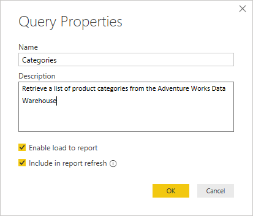
