https://www.motogp.com/en/Results+Statistics

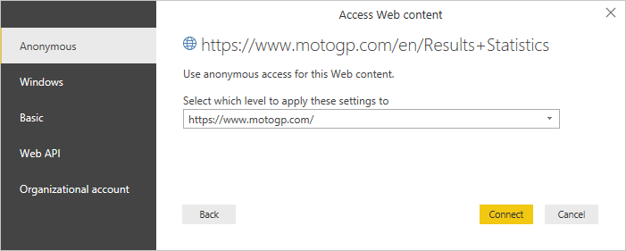

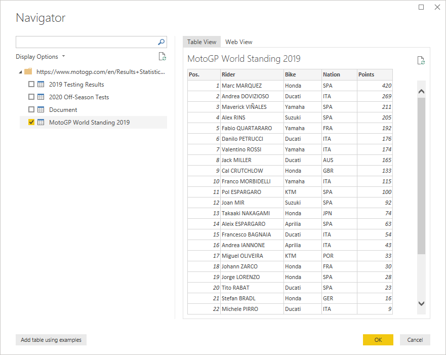

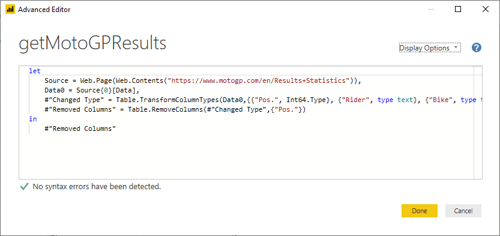

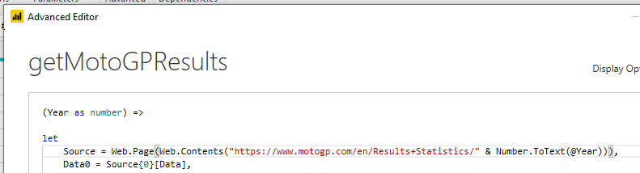

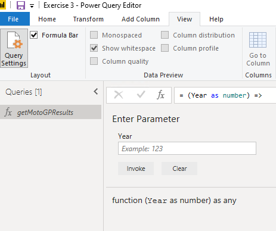

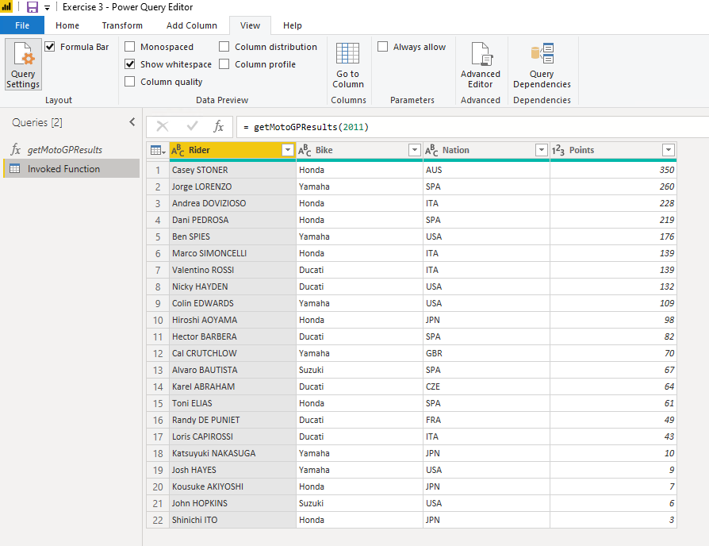

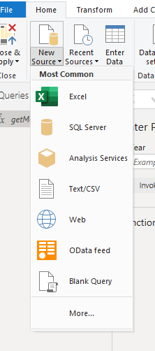

={2000..2019}

Convert to table=

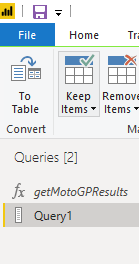

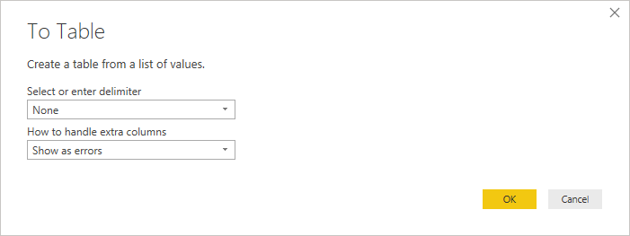

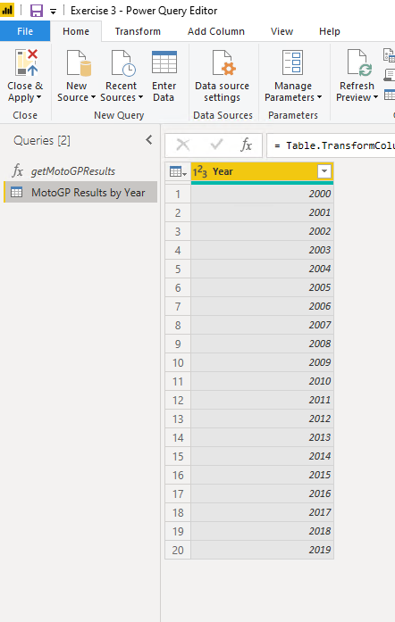

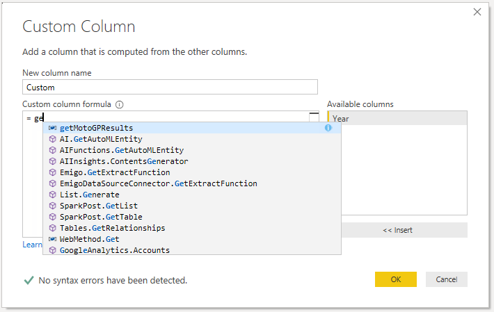

Add Column

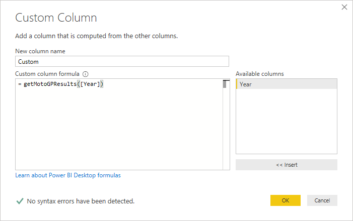

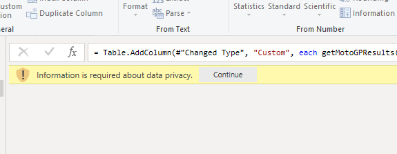

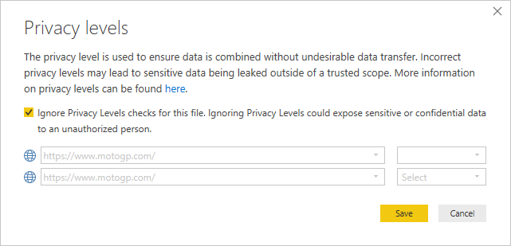

Expand

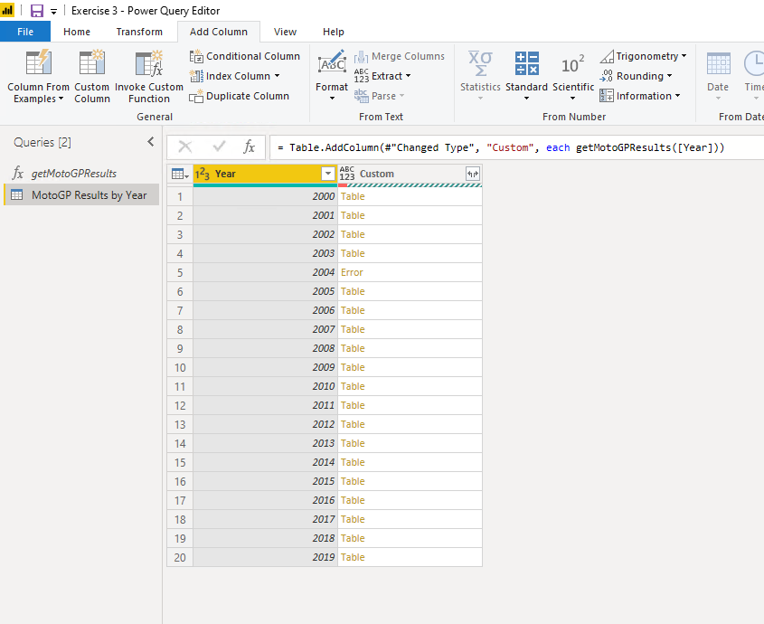

Go and check the 2004 results (also 1985)

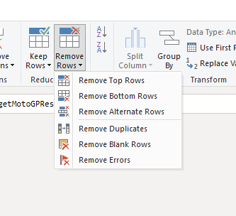

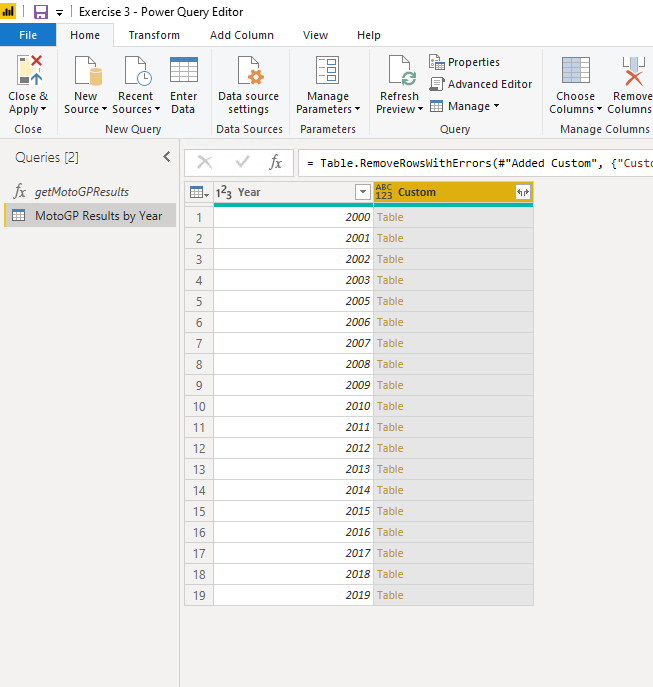

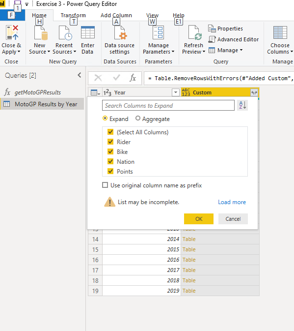

Change datatypes

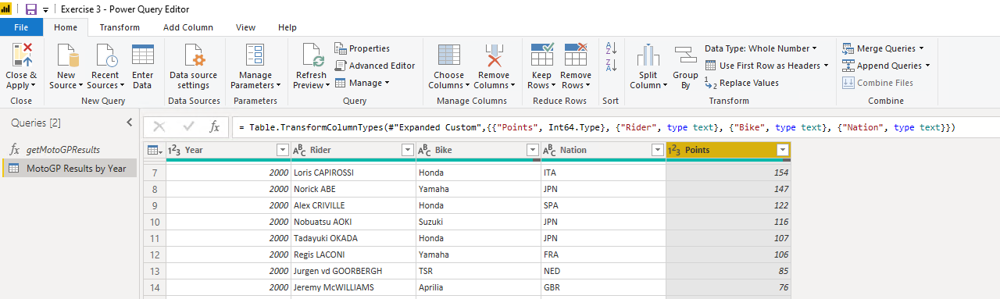

Slicer

Do some visuals

**Optional**:

Mapping table,

fill in missing values for 1985 and 2004

Enlighten Flags Slicer

Country Names Mashup.
