Lab1, Exercise 3

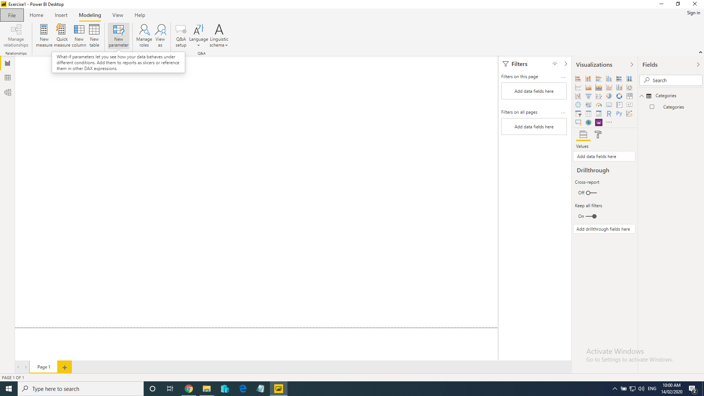

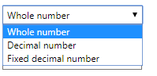

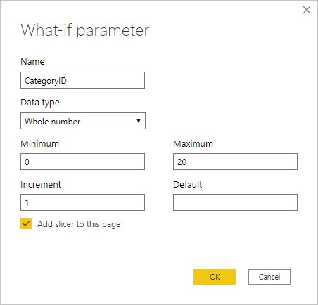

NOT QUERY PARAMETERS!!!!

Do Query parameters here!!! then create a function

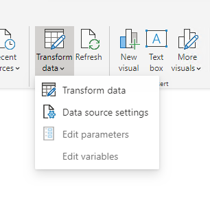

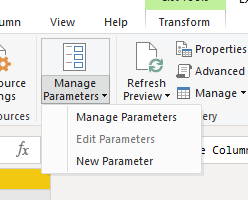

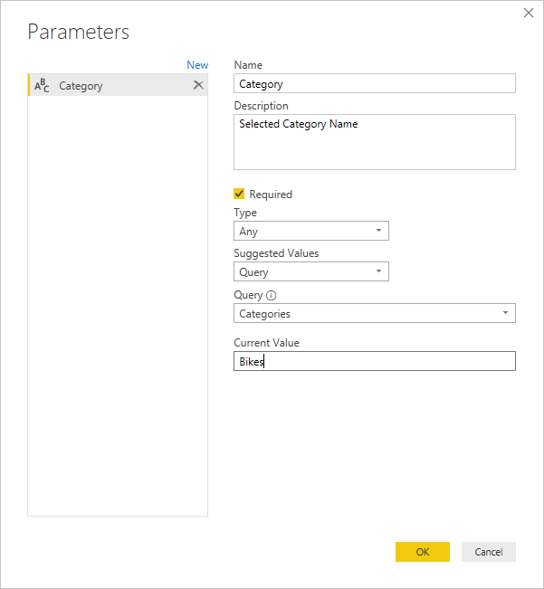

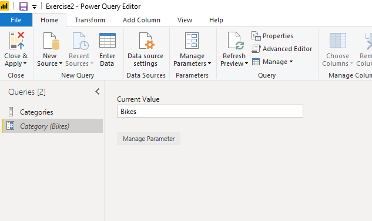

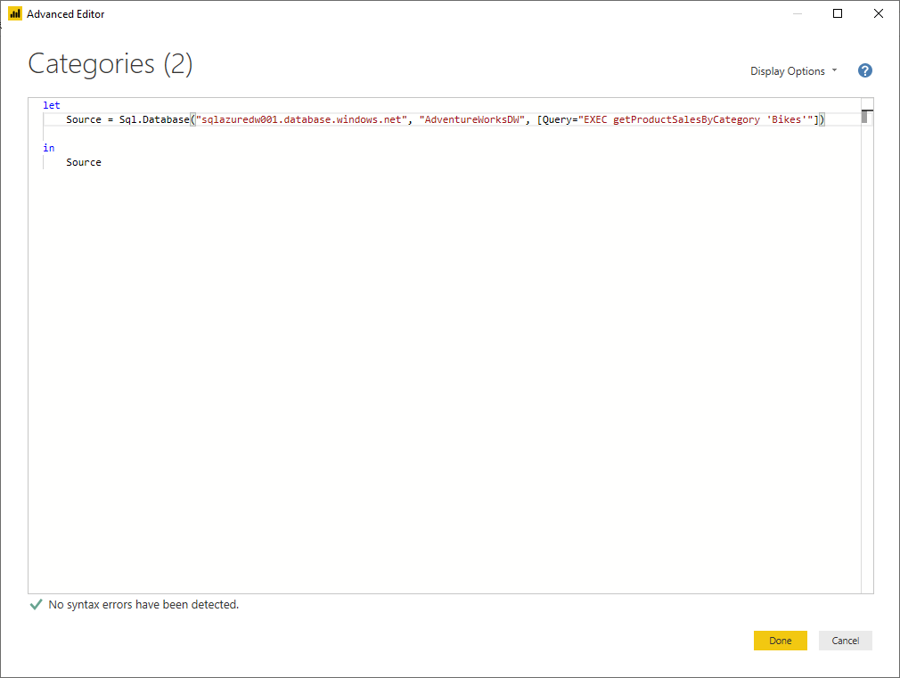

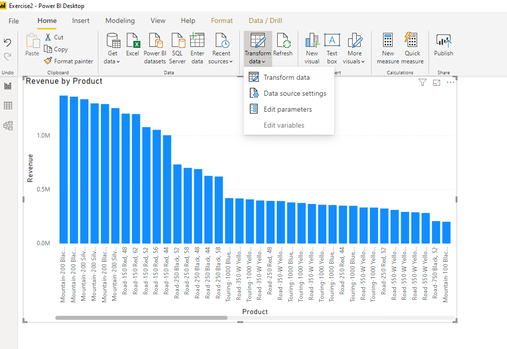

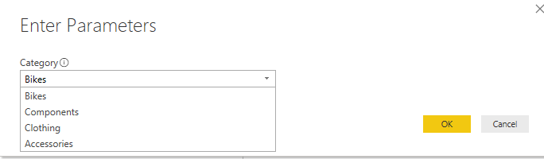

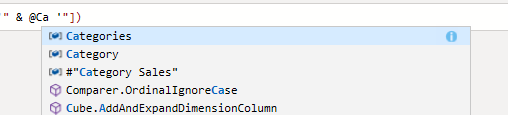

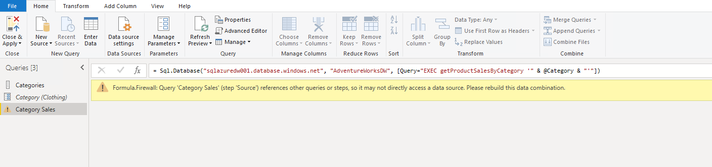

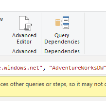

let

Source = Sql.Database("sqlazuredw001.database.windows.net", "AdventureWorksDW",
[Query="EXEC getProductSalesByCategory '" & \@Category & "'"])

in

Source

Query is correct, it’s the privacy settings that mess it up, let’s see if we can
fix it, properly

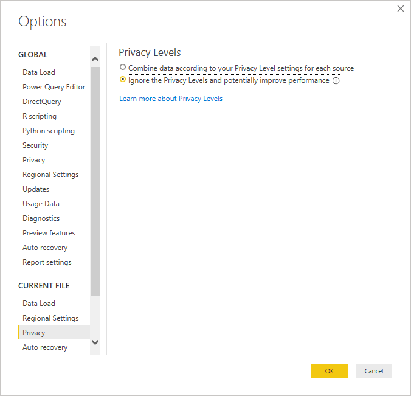

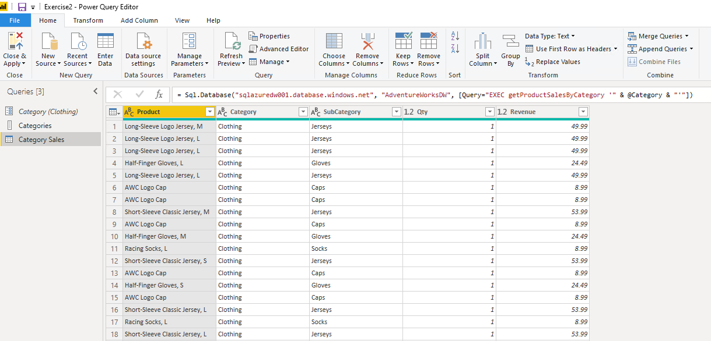

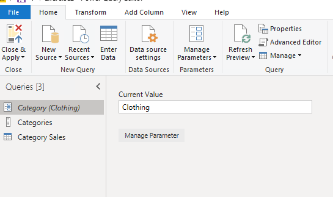

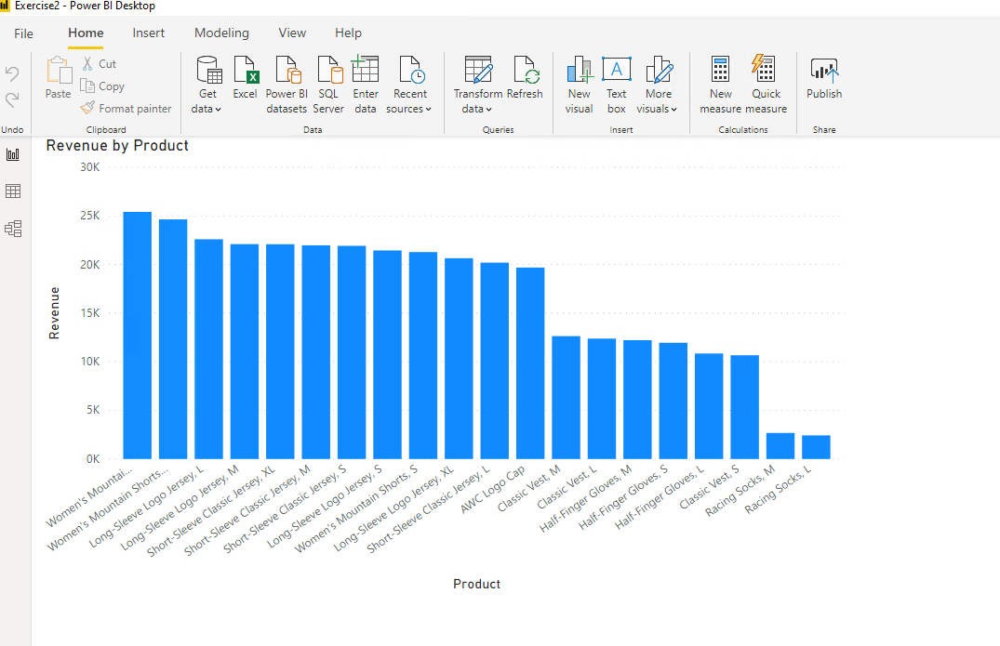

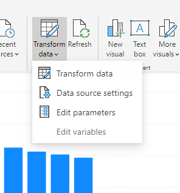

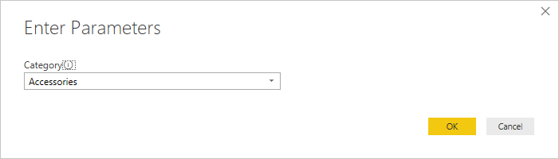

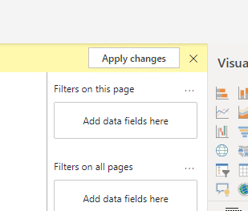

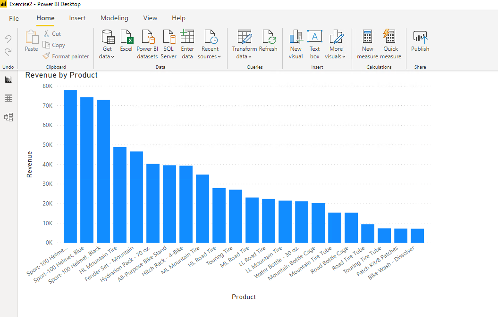
