Install R first – remote to VM for screen shots (on K1??)

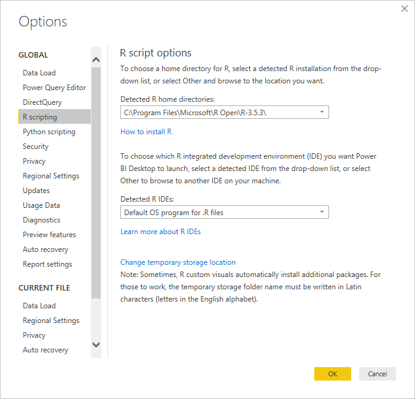

**Use R in Query Editor**

[R](https://mran.microsoft.com/documents/what-is-r) is a powerful programming
language that many statisticians, data scientists, and data analysts use. You
can use **R** in Power BI Desktop's **Query Editor** to:

-   Prepare data models

-   Create reports

-   Do data cleansing, advanced data shaping, and dataset analytics, which
    include missing data completion, predictions, clustering, and more.

**Install R**

You can download **R** for free from the [Revolution Open download
page](https://mran.revolutionanalytics.com/download/) and the [CRAN
Repository](https://cran.r-project.org/bin/windows/base/).

**Install mice**

You need to have
the [mice library](https://www.rdocumentation.org/packages/mice/versions/3.5.0/topics/mice) installed
in your R environment. Without **mice**, the sample script code won't work
properly. The **mice** package implements a method to deal with missing data.

To install **mice**:

1.  Launch the R.exe program (for example, C:\\Program Files\\Microsoft\\R
    Open\\R-3.5.3\\bin\\R.exe)

2.  Run the install command:

Copy

\> install.packages('mice')

**Use R in Query Editor**

To demonstrate using **R** in **Query Editor**, we'll use an example stock
market dataset contained in a .csv file and work through the following steps:

1.  from the **Home** ribbon, select **Get Data \> Text/CSV**.

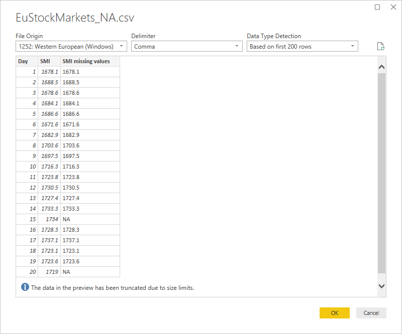

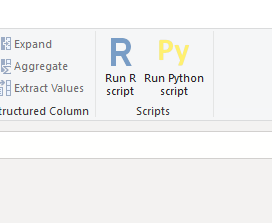

From the transform ribbon

Or create a blank query and type this???

dataset \<- read.csv(file="\<Your File Path\>/EuStockMarkets_NA.csv",
header=TRUE, sep=",")

\# 'dataset' holds the input data for this script

library(mice)

tempData \<- mice(dataset,m=1,maxit=50,meth='pmm',seed=100)

completedData \<- complete(tempData,1)

output \<- dataset

output\$completedValues \<- completedData\$"SMI missing values"

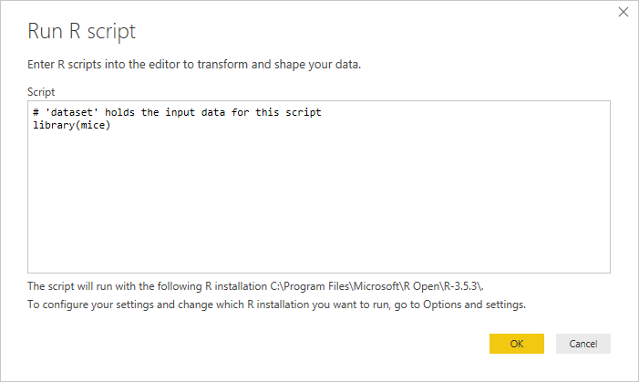

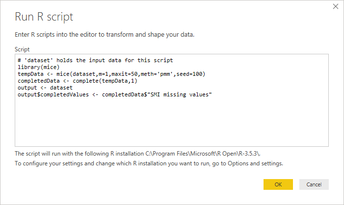

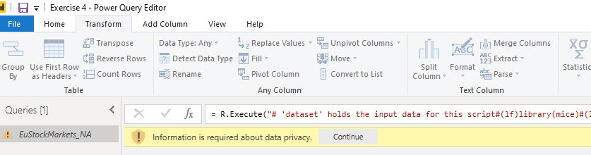

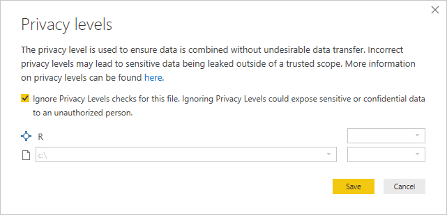

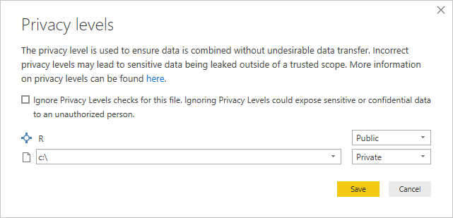

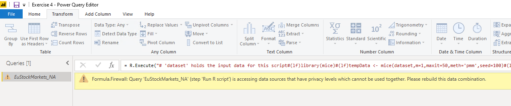

IF you didn’t install the package mice, you’ll get this: (it does take a few
minutes)

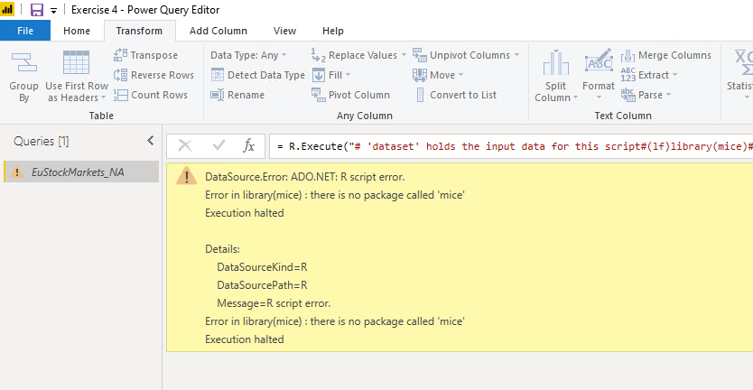

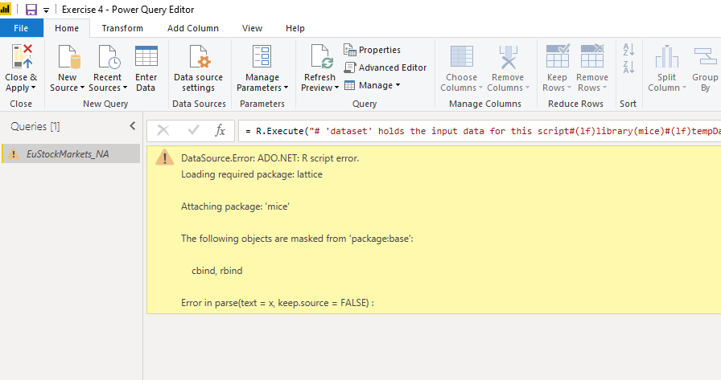
