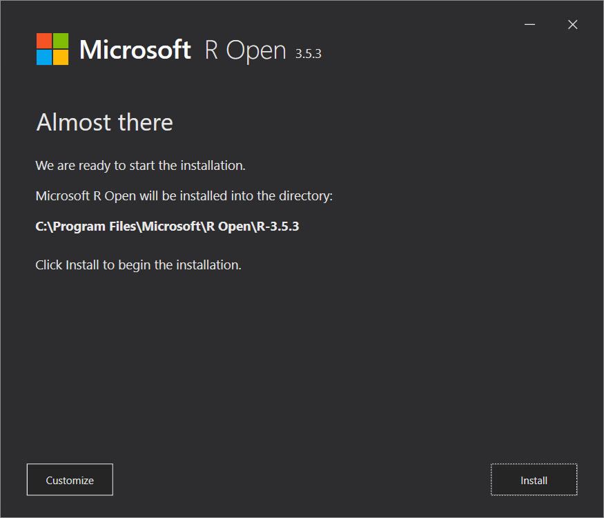

Lab Exercise – Install Revolution R
===================================

Task 1: Examine Power BI Desktop Settings
-----------------------------------------

1.  Start the Power BI desktop

2.  Select File Options

3.  Select R scripting

4.  Click on the link as shown to open Microsoft docs  
    *(this will take you to:*
    <https://docs.microsoft.com/en-us/power-bi/desktop-r-visuals> *)*

Task 2: Download the R Open installation
----------------------------------------

1.  In Microsoft docs, click the link to go to the Revolution Open download page

1.  From the R Open and MKL downloads page, select the Windows Download button
    and wait for the package to download.

Task 3: Install Revolution R on your computer
---------------------------------------------

1.  Once the package has completed downloading, click on it to launch the
    installation. If necessary, select Yes to the UAC dialog. *(Close the power
    BI desktop before beginning the install)*.

1.  Click the continue button

2.  Accept all the defaults and click Continue

1.  Acknowledge the license Agreement(s) to continue with the installation.

*When ready to install, note the installation path. This path will be
autoimatically set for you in the options of the Power BI desktop program. If
this is not the case you will have to enter the above path in the R Scripting
options page manually*.

1.  Click the install button

1.  After a few moments R Open will be installed and ready to use.

Task 4: Verify the installation of R
------------------------------------

1.  Start the power BI desktop

2.  Open the Options menu and select the R Scripting section

End of Exercise
