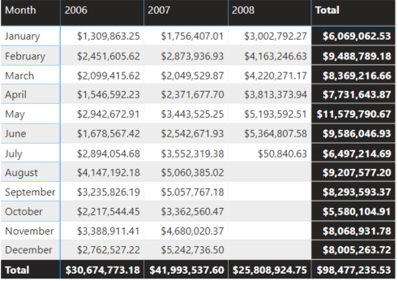
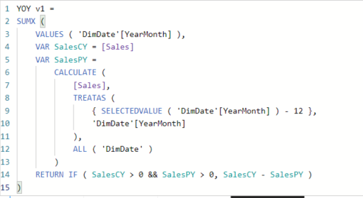
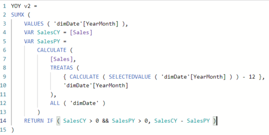
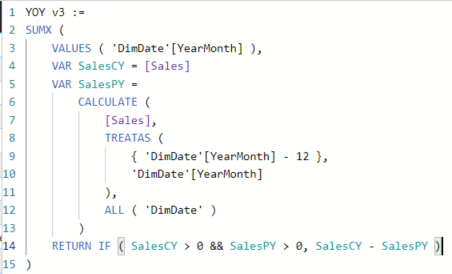
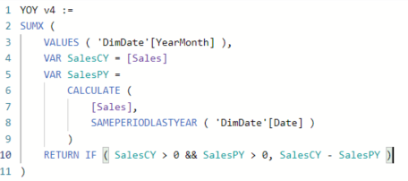

Scenario
--------

The [CALCULATE](https://dax.guide/calculate/) and [CALCULATETABLE](https://dax.guide/calculatetable/) function
in DAX transform existing row contexts into an equivalent filter context. This
transformation is called a context transition.

### Context Transition and Filter Arguments

The interaction between the filter arguments
of [CALCULATE](https://dax.guide/calculate/) or [CALCULATETABLE](https://dax.guide/calculatetable/) and
the filter context generated by the context transition is a possible source of
confusion. For example, consider the following DAX expression that should
compute the year over year of Sales Amount considering only the months present
in both years. This is important for a correct evaluation of 2008, which does
not have data between August and December.

Task 1: Open the starting Power BI Report
-----------------------------------------

1.  Open the Context Transition and Filters Power BI Desktop file from the
    starter folder

2.  Examine the tabular report showing the calendar year and month for each
    sales amount

>   Task 2: Add a new measure

1.  using the following DAX expression to create a YOY measure

COPY:

YOY v1 =

SUMX (

VALUES ( 'DimDate'[YearMonth] ),

VAR SalesCY = [Sales]

VAR SalesPY =

CALCULATE (

[Sales],

TREATAS (

{ SELECTEDVALUE ( 'DimDate'[YearMonth] ) - 12 },

'DimDate'[YearMonth]

),

ALL ( 'DimDate' )

)

RETURN IF ( SalesCY \> 0 && SalesPY \> 0, SalesCY - SalesPY )

)

1.  This doesn’t work: On line 9
    the [SELECTEDVALUE](https://dax.guide/selectedvalue/) function retrieves the
    YearMonth value in the current filter context. The intention was to retrieve
    the single value of YearMonth iterated by SUMX. The context transition
    performed by [CALCULATE](https://dax.guide/calculate/) on line 6 actually
    transforms the row context over ‘Date'[YearMonth] into a filter context, but
    this only applies to the first argument
    of [CALCULATE](https://dax.guide/calculate/) – which is the expression found
    on line 7. The context transition does not have any effect on the following
    arguments of [CALCULATE](https://dax.guide/calculate/), from line 8 to line
    12.

2.  The YOY v1 measure always returns blank. The filter context still has all
    the months of the selected year for every cell – due to the multiple
    selection, SELECTEDVALUE returns blank

3.  There are two possible workarounds for that. The first one is to enforce the
    context transition on the filter argument
    in [CALCULATE](https://dax.guide/calculate/) using
    another [CALCULATE](https://dax.guide/calculate/) or [CALCULATETABLE](https://dax.guide/calculatetable/) function
    (see line 9)

YOY v2 =

SUMX (

VALUES ( 'dimDate'[YearMonth] ),

VAR SalesCY = [Sales]

VAR SalesPY =

CALCULATE (

[Sales],

TREATAS (

{ CALCULATE ( SELECTEDVALUE ( 'dimDate'[YearMonth] ) ) - 12 },

'dimDate'[YearMonth]

),

ALL ( 'dimDate' )

)

RETURN IF ( SalesCY \> 0 && SalesPY \> 0, SalesCY - SalesPY )

)

1.  The second workaround is to use the existing row context on line 9. The
    filter argument of [CALCULATE](https://dax.guide/calculate/) does not
    receive any context transition, so any row context is still available

YOY v3 :=

SUMX (

VALUES ( 'DimDate'[YearMonth] ),

VAR SalesCY = [Sales]

VAR SalesPY =

CALCULATE (

[Sales],

TREATAS (

{ 'DimDate'[YearMonth] - 12 },

'DimDate'[YearMonth]

),

ALL ( 'DimDate' )

)

RETURN IF ( SalesCY \> 0 && SalesPY \> 0, SalesCY - SalesPY )

)

The previous examples do not rely a time intelligence function, because using a
time intelligence function could be misleading when trying to understand the
effects of the context transition. In fact, the following measure works properly
using [SAMEPERIODLASTYEAR](https://dax.guide/sameperiodlastyear/), without
requiring an
additional [CALCULATE](https://dax.guide/calculate/) or [CALCULATETABLE](https://dax.guide/calculatetable/) to
perform the context transition.

YOY v4 :=

SUMX (

VALUES ( 'DimDate'[YearMonth] ),

VAR SalesCY = [Sales]

VAR SalesPY =

CALCULATE (

[Sales],

SAMEPERIODLASTYEAR ( 'DimDate'[Date] )

)

RETURN IF ( SalesCY \> 0 && SalesPY \> 0, SalesCY - SalesPY )

)

When a time intelligence function in DAX receives a column reference as a
parameter, that column reference is implicitly wrapped in a
CALCULATETABLE/VALUES function.
The [CALCULATETABLE](https://dax.guide/calculatetable/) function performs a
context transition if one or more row contexts are active. In other words, any
time intelligence function such as

SAMEPERIODLASTYEAR ( 'DimDate'[Date] )

Could be read as

SAMEPERIODLASTYEAR ( CALCULATETABLE ( VALUES ( 'DimDate'[Date] ) ) )

This is the reason why [LASTDATE](https://dax.guide/lastdate/) – which is a time
intelligence function – should never be used within a row
context: [MAX](https://dax.guide/max/) is a better choice in that case.

END of Exercise
