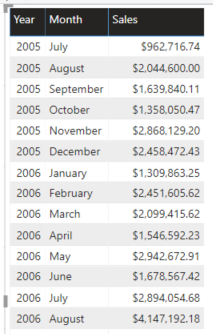
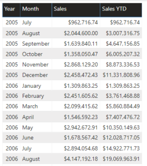
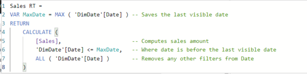
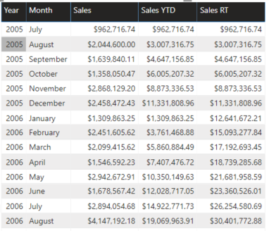

Module 3 – Advanced DAX

Exercise 1: Calculating Running Totals

Task 1: Open Power BI Report

1.  Open the Running Totals Power BI Desktop file from the starter folder

2.  Examine the tabular report showing the calendar year and month for each
    sales amount

>   Task 2: Add a new measure

1.  using the following DAX expression to create a YTD measure

>   Sales YTD =

>   CALCULATE(

>   [Sales],

>   DATESYTD('DimDate'[Date])

>   )

1.  Add the Sales YTD measure to the table.

2.  For each month, this returns the aggregated value of all sales in that month
    plus all previous months within the same calendar year:

[DATESYTD](https://dax.guide/datesytd/) resets every year. If the goal is to sum
values over more than one year, then [DATESYTD](https://dax.guide/datesytd/) is
no longer useful. In that case, the calculation requires an explicit filter in
plain DAX.  
The computation of the running total requires a filter that retrieves all the
dates prior to the current date in the filter context.

Task 3: Create a Running Total Measure

1.  Enter the following DAX Expression:

>   Sales RT =

>   VAR MaxDate = MAX ( 'DimDate'[Date] )

>   RETURN

>   CALCULATE (

>   [Sales],

>   'DimDate'[Date] \<= MaxDate,

>   ALL ( 'DimDate'[Date] )

>   )

1.  Check the results:

1.  First, the MaxDate variable saves the last visible date. Then, two CALCULATE
    filters remove all the filters on the Date table and they replace the filter
    on the Date column showing all the dates prior to MaxDate.

2.  The figure below shows the difference between year-to-date which resets at
    year end, and running totals that carry into the new year.

END of Exercise
