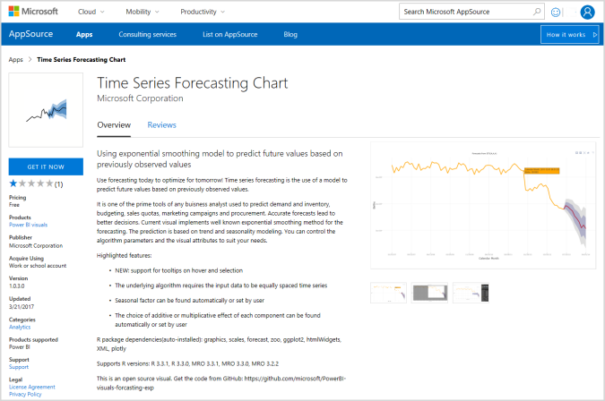
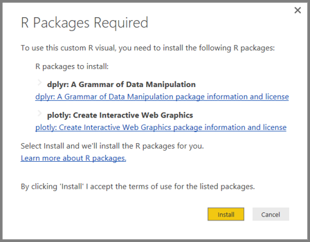

Module 4: Advanced Visualisation
================================

Exercise 3: Using R Powered Custom Visuals
------------------------------------------

### Task 1: Obtain a Custom Visual

1.  Start Power BI Desktop

2.  Click on the add custom visual button

3.  Search Appsource for the following:

1.  Download it.

### Task 2: Create a new R powered Visualisation

1.  Create a visualisation from it, But also note – this:

1.  There may be other manual things to do on the R command line to install
    further packages etc.

End of Exercise
